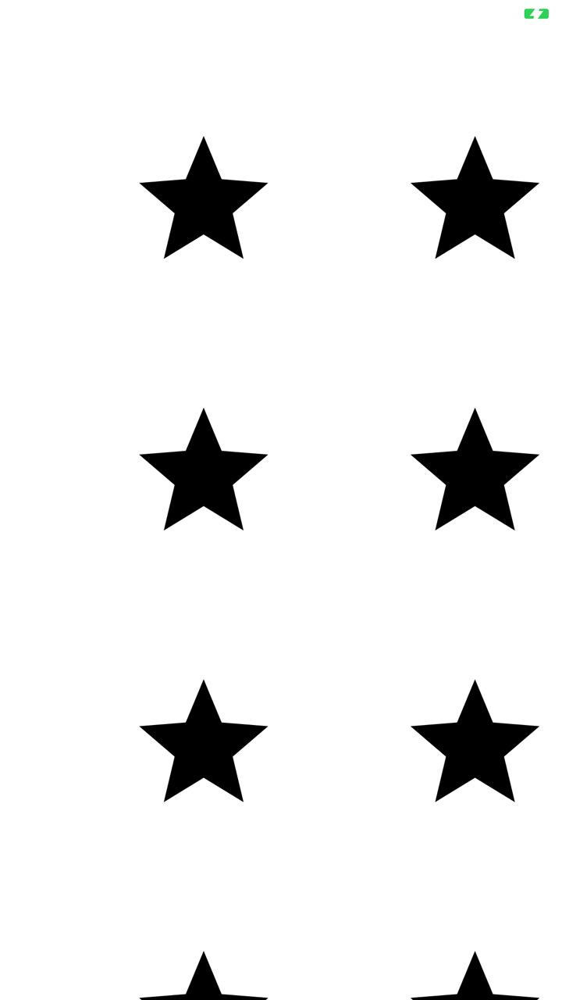
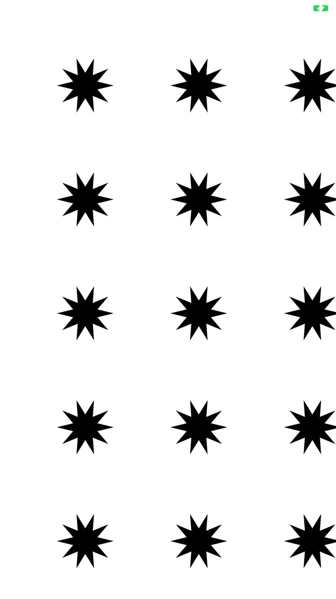

# Swift - Core Graphics - Demo Project

<html>
<head>
</head>
<body>

<h1>Swift - Core Graphics Demo<h1>
<h2>Project Overview<h3>
<h3>Drawing custom shapes in UIKit with Swift<h3>
<h3>Custom shapes samples - see below<h3>

 

<h3>Screenshots for user flows<h3>

<h4>Rounded star<h4>

 

<h3>Developed by Serg Liamthev:<h3>
<a href="https://github.com/SergLam">Github</a>
 
<a href="https://www.linkedin.com/in/serg-lam/">LinkedIn</a>

</body>
</html>
